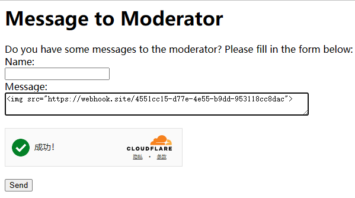
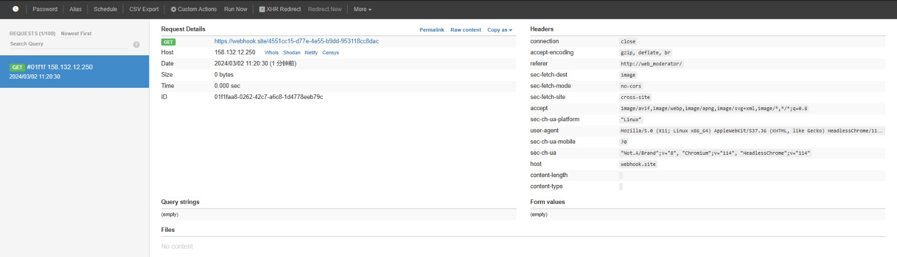
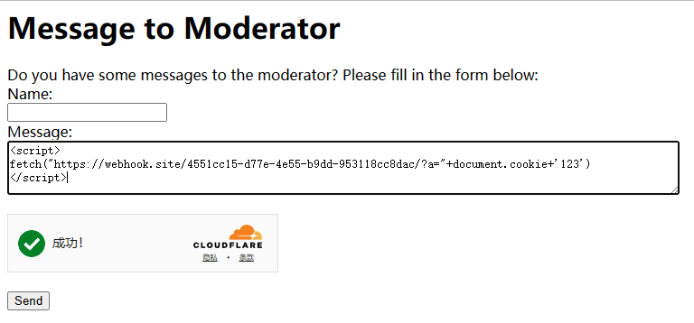
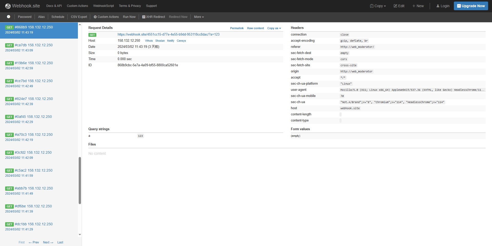
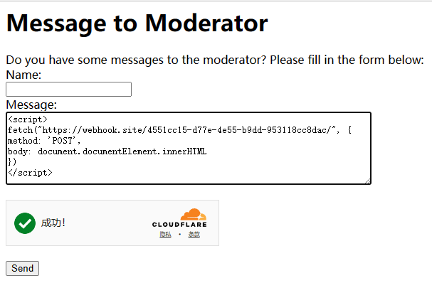
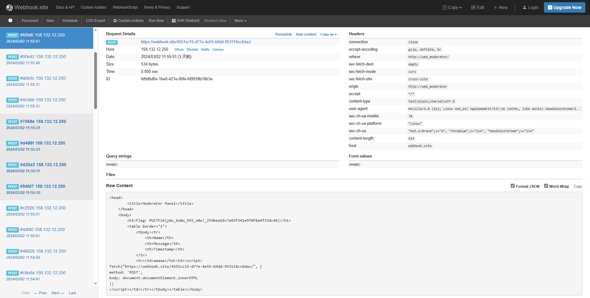

# Moderator / 網站版主

## Approach

It says
> Leave your message, moderator will check the message when he is free.

Try it

It can see that the link is visited

Try it

It can see that the flag is not in the cookie

Try it

Oh, it can see that the flag is in h1

## Flag

`PUCTF24{y0u_kn0w_X55_n0w!_2fdbea18c7a95f341e970f8a4f33dc46}`