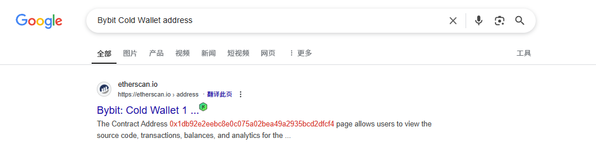
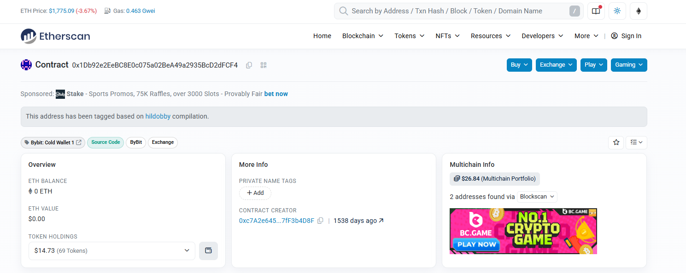
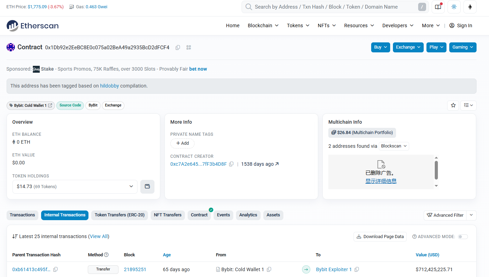
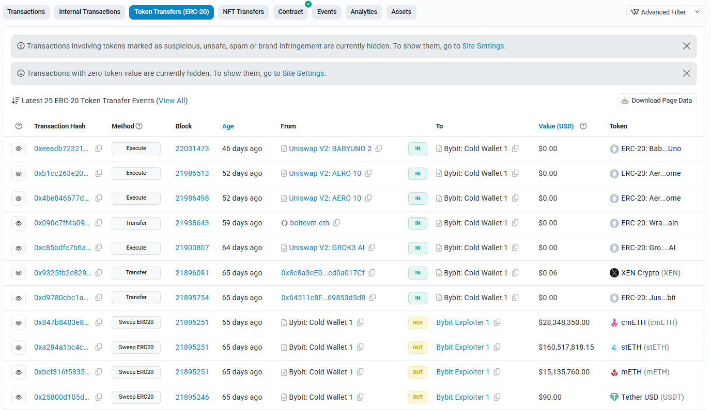
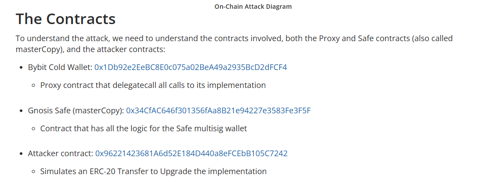
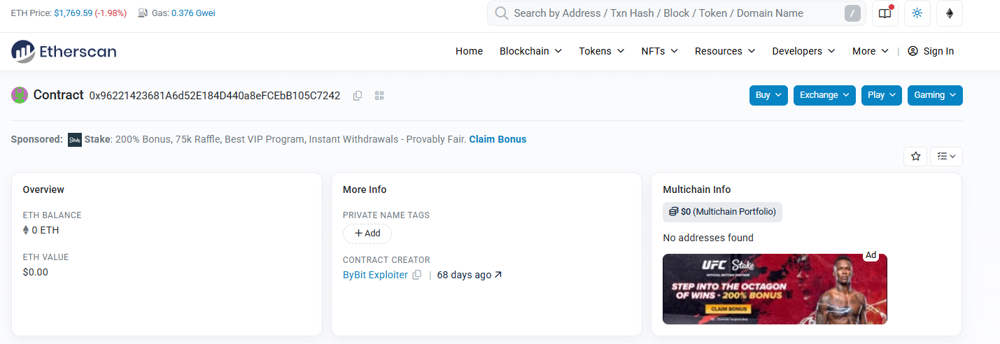
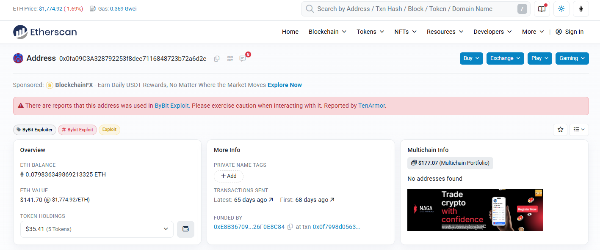
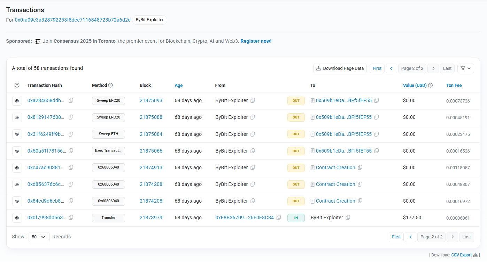

# Bybit Attack / Bybit 攻擊

There was a Bybit exchange hack occured during Feb 2025. You can find the following information about the attack?
1. Bybit cold wallet address
2. The transaction hash which created the first attacker smart contract
3. The transaction hash which the attacker extract the funds from Bybit (Most ETH)
4. The attacker address found in the attacker smart contract

Author: Sunny

Flag Format: PUCTF25{address1_address2_address3_address4}

## Approach

### Q1

Just Google

Find `0x1Db92e2EeBC8E0c075a02BeA49a2935BcD2dFCF4`

### Q3

Just Click `Internal Transactions`

And Click `Token Transfers (ERC-20)`

See it

| From                 | To                | USD            |
| -------------------- | ----------------- | -------------- |
| Bybit: Cold Wallet 1 | Bybit Exploiter 1 | 712,425,225.71 |
| Bybit: Cold Wallet 1 | Bybit Exploiter 1 |  28,348,350.00 |
| Bybit: Cold Wallet 1 | Bybit Exploiter 1 | 160,517,818.15 |
| Bybit: Cold Wallet 1 | Bybit Exploiter 1 |  15,135,760.00 |
| Bybit: Cold Wallet 1 | Bybit Exploiter 1 |          90.00 |

Find `0xb61413c495fdad6114a7aa863a00b2e3c28945979a10885b12b30316ea9f072c`

### Q4

Just Google

Find Attacker `Contract`

Find `Contract Creator`

Find `ByBit Exploiter`

Find `0x0fa09C3A328792253f8dee7116848723b72a6d2e`

### Q2

Just Find first `Contract Creation`

Find `0x84cd9d6cb84df9df4be638899f4a56053ed98042febd489ef3d51a3ed3652d40`

## Flag

`PUCTF25{0x1Db92e2EeBC8E0c075a02BeA49a2935BcD2dFCF4_0x84cd9d6cb84df9df4be638899f4a56053ed98042febd489ef3d51a3ed3652d40_0xb61413c495fdad6114a7aa863a00b2e3c28945979a10885b12b30316ea9f072c_0x0fa09C3A328792253f8dee7116848723b72a6d2e}`