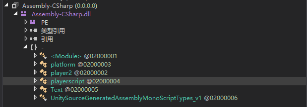
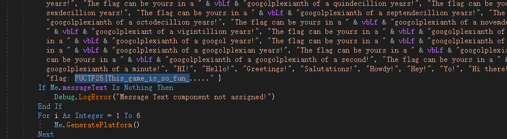
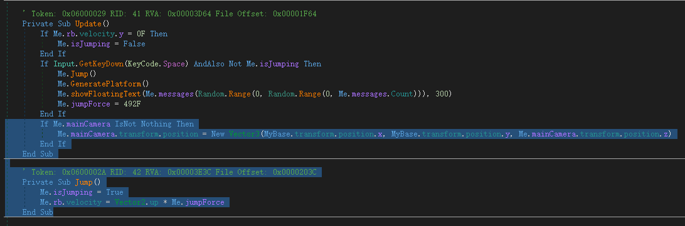
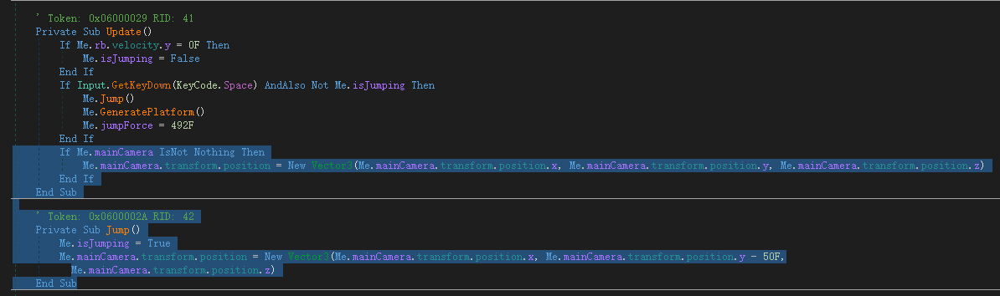
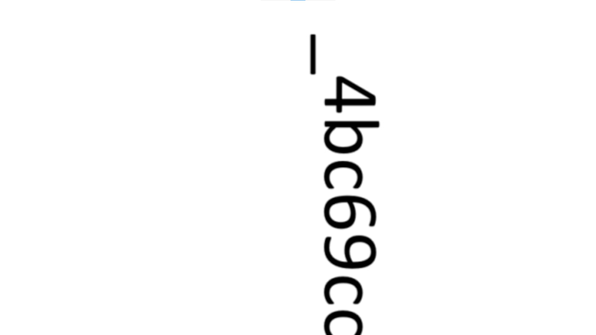

# Jump Jump

I created a simple game for you. Hope you don‘t break your spacebar. Have fun!!!

Author: Paco

Flag Format: PUCTF25{[a-zA-Z0-9_]+_[a-fA-F0-9]{32}}

[Download](Jump_Jump.zip)

## Approach

https://github.com/dnSpyEx/dnSpy

Open `Jump Jump\Jump Jump_Data\Managed\Assembly-CSharp.dll`

Before

After

So

## Flag

`PUCTF25{This_game_is_so_fun_4bc69ccfb67906528c43a56b91dcc7d5}`